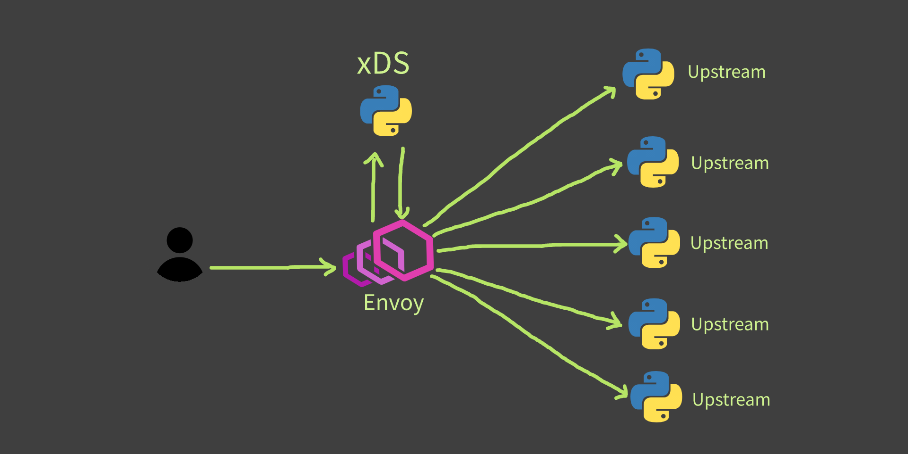

## Envoyproxy API-based dynamic endpoint discovery configuration

## Architecture


## Run Envoy
```
docker run -d --name api-eds -e ENVOY_UID=777 -e ENVOY_GID=777 -p 9000:9000 -p 80:10000 ilkerispir/envoy
```
## Run Upstream
```

for i in 8081 8082 8083 8084 8085
  do
    docker run -d -e EDS_SERVER_PORT=$i ilkerispir/upstream;
    sleep .5
done
```

## Run xDS
```
docker run -p 8080:8080 -d ilkerispir/xds
```

## Add Service
```
curl -X POST --header 'Content-Type: application/json' --header 'Accept: application/json' -d '{
  "hosts": [
    {
      "ip_address": "172.18.0.3",
      "port": 8081,
      "tags": {
        "az": "us-central1-a",
        "canary": false,
        "load_balancing_weight": 50
      }
    }
  ]
}' http://localhost:8080/edsservice/myservice
```

## Remove all containers & images
```
docker rm -vf $(docker ps -a -q)
docker rmi -f $(docker images -a -q)
```

https://hub.docker.com/u/ilkerispir