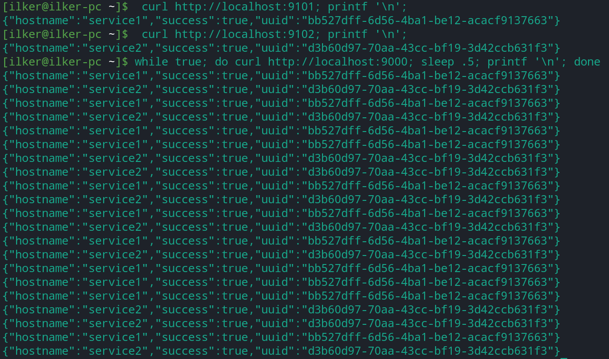

# Envoyproxy xDS Server


## [Envoy Proxy](https://www.envoyproxy.io/)
- It is a modern Layer7(App) and Layer3(TCP) proxy
- Incredibly modernized version of reverse proxies like NGINX, HAProxy
- It is used in many projects: Istio service mash, API gateway products, etc.
- Interesting part: Programming via API instead of file (xDS protocol)
- Developed by Matt Klein at Lyft
- Donated to CNCF(Kubernetes, gRPC, etc.) It graduated from there.
- Those who integrate Envoy into their infrastructure: Google, AWS, etc.
- It has support for Wire protocols(Redis, Memcached, MySQL, MongoDB, etc.)
- RPC level LB instead of connection-level LB

### Telemetry/Observability Properties
- Metrics(L7 HTTP metrics)
    * Request count
    * Latency
    * Error rate
    * Status code
    * Bytes received/sent
    * Envoy's own metrics(CPU/Memory, TCP connection, Bytes, Bandwidth, QPS)
- Distributed Tracing
    * A monitoring method that shows how long the RPCs between microservices keep and where they go.
    * Add TRACING HEADER if missing in incoming requests
    * Upload TRACEs to a certain location for requests coming to the server
        * Request In TRACE ID, start, end(Response)

## Architecture


## Run Envoyproxy
```
func-e run -c envoy.yaml
```

## Run xDS & Resource

### Docker Compose
```
docker-compose up -d
```
### Docker
```
docker run --rm -i -t -p  9101:8080 ilkerispir/resource
docker run --rm -i -t -p 9102:8080 ilkerispir/resource
docker run --rm -i -t -p 9002:9002 ilkerispir/xds
docker run --rm -i -t -p 9003:9003 ilkerispir/envoy
```

## Run Jenkins
```
docker run -d -p 9080:8080 -p 60000:50000 jenkins/jenkins
```

## cURL Test
```
while true; do curl http://localhost:9000; sleep .5; printf '\n'; done
```

## Result


## Remove all containers & images
```
docker rm -vf $(docker ps -a -q)
docker rmi -f $(docker images -a -q)
```

## References
* https://www.envoyproxy.io/
* https://func-e.io/
* https://excalidraw.com/
* https://www.jenkins.io/doc/book/installing/linux/
* https://www.youtube.com/watch?v=Uiv5m20lYaE
* https://medium.com/hepsiburadatech/envoy-bgp-ecmp-frr-ile-da%C4%9F%C4%B1t%C4%B1k-frontproxy-ortam-haz%C4%B1rlama-e8b98211bdce
* https://static.sched.com/hosted_files/kccncna20/03/BuildingAnEnvoyControlPlane.pdf

## 🔗 Links
[](https://ilkerispir.com/)
[](https://www.linkedin.com/in/ilkerispir/)

## Author
- [@ilkerispir](https://www.github.com/ilkerispir)