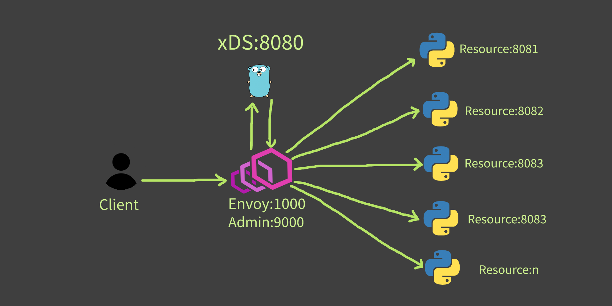

## Envoyproxy API-based dynamic endpoint discovery configuration

## Architecture


## Run Envoy
```
cd envoy; func-e run -c envoy.yaml
```

## Run xDS
```
cd xds; go run grpc_server.go

docker run -p 8080:8080 -d --restart=always ilkerispir/xds
```

## Run Resource
```
cd resource; python server.py -p 8081
```

## Remove all containers & images
```
docker rm -vf $(docker ps -a -q)
docker rmi -f $(docker images -a -q)
```

https://hub.docker.com/u/ilkerispir